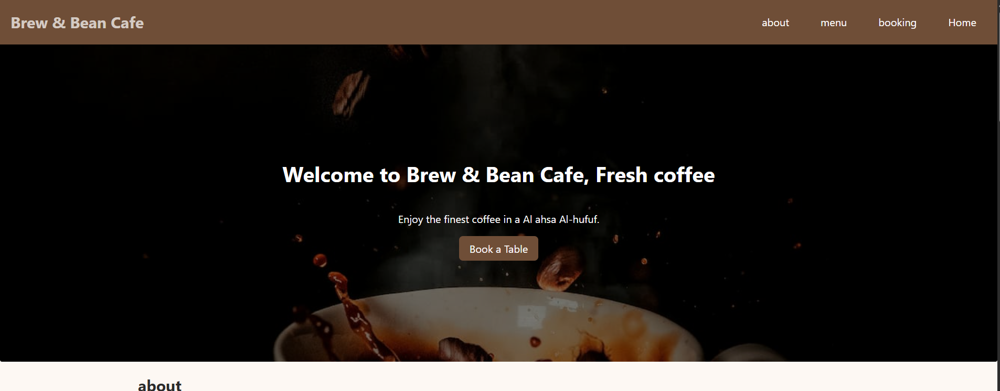

# ☕ Brew & Bean — Café Landing Page

A fully responsive landing page for a specialty café, featuring a menu section and a
table-booking form with real-time validation.

**🔗 Live demo:** https://ahmed71huz.github.io/Brew-and-bean-cafe/

## Features
- Responsive, mobile-first layout (Flexbox + CSS Grid)
- Semantic, accessible HTML (labels, alt text, landmarks)
- Mobile navigation menu
- Booking form with custom validation and inline error messages
- Success confirmation message
- Smooth slide-down mobile menu (☰ / ✕)
- Booking form checks: no past dates, only within opening hours (3 PM – 12 AM)
- Full-width hero section

## Tech Stack
HTML5 · CSS3 · Vanilla JavaScript · GitHub Pages

## Run Locally
1. Clone the repo: `git clone https://github.com/ahmed71huz/Brew-and-bean-cafe.git`
2. Open `index.html` in your browser (or use the VS Code Live Server extension).

## What I Learned
- Structuring a page with semantic HTML
- Building responsive layouts with Flexbox, Grid and media queries
- Handling DOM events and validating forms with JavaScript
- Using Git and deploying with GitHub Pages